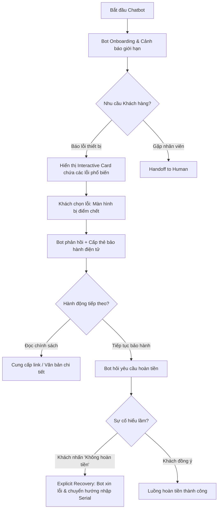

# BẢN NHÁP LÝ THUYẾT LUỒNG 2: UX AUDIT, ONBOARDING REDESIGN & HOOK MODEL
**Người phụ trách:** Nhật Anh

---

## 1. Onboarding Audit (Bài 3)
Phân tích ma sát của luồng chatbot Ngày 18 theo các nhãn:
- **Keep (Giữ lại):** 
  - Nút "Gặp nhân viên thật" (Handoff) ở góc phải. (Lý do: Tạo sự an tâm (Implicit System Feedback), cho phép khách hàng kiểm soát quyền thoát khỏi bot bất cứ lúc nào).
  - Tin nhắn Onboarding rõ ràng chức năng và giới hạn của bot ("Tôi có thể tra cứu... Tôi không có quyền tự động hoàn tiền").
- **Remove (Loại bỏ):**
  - Các bước bắt người dùng gõ văn bản dài để mô tả lỗi. (Lý do: Tốn thời gian, dễ gây hiểu lầm ngữ nghĩa, tạo ma sát cao).
  - Luồng bot tự phán đoán lỗi mà không có sự xác nhận của người dùng.
- **Delay (Trì hoãn):**
  - Việc yêu cầu mã Serial. (Lý do: Bắt khách hàng nhập một chuỗi ký tự khó nhớ ngay từ đầu sẽ làm rớt (drop) khách hàng. Chỉ yêu cầu khi đã xác định được luồng cần xử lý bảo hành).
- **Simplify (Đơn giản hóa):**
  - Chuyển việc mô tả lỗi từ nhập liệu văn bản tự do (free-text) sang các nút chọn (InteractiveCard - Ask Action) để giảm thiểu Effort của khách hàng và rủi ro AI hiểu sai.

---

## 2. Redesigned Journey (Bài 3)
Sơ đồ hành trình mới tập trung vào sự tối giản và giảm thiểu chi phí sửa sai:

---

## 3. Bảng Before/After & Recovery (Bài 3)

| Tiêu chí | Hành trình cũ (Ngày 18) | Hành trình mới (Thiết kế lại) |
| :--- | :--- | :--- |
| **Nhập liệu** | Bắt khách hàng tự gõ text (Ví dụ: "Tivi nhà tôi tự dưng bị đen xì nhưng vẫn nghe thấy tiếng"). | Cung cấp các nút lỗi phổ biến (Interactive Card). Rất nhanh và chính xác. |
| **Bằng chứng giải thích** | Bot chỉ trích dẫn dạng Text thô. Trông thiếu chuyên nghiệp và không đủ độ tin cậy. | Hiển thị thẻ **Digital Warranty Card** bắt mắt với đầy đủ thông tin bảo hành và trích dẫn chuẩn xác. |
| **Luồng phục hồi lỗi (Recovery)** | Bot cứ tiếp tục làm tới, khách phải gõ lại từ đầu để quay lại luồng. | Thiết kế **Explicit Feedback Button**: "Không, tôi không muốn hoàn tiền". Nhấn vào là bot tự động quay xe, xin lỗi và chuyển luồng đúng. |
| **Trải nghiệm gõ mã Serial** | Bot bắt nhập liền. Mất thời gian. Nếu lỗi, bắt nhập lại n lần. | Bot chỉ hỏi khi cần. Nếu mâu thuẫn hệ thống, bot tự động dừng (Don't Act) và chuyển cho nhân sự (Handoff) kèm theo toàn bộ bối cảnh để khách không phải kể lại. |

---

## 4. Hook Model (Bài 5.2)
Thiết kế vòng lặp tạo thói quen sử dụng Smart TV thay vì các thiết bị giải trí khác:

1. **Trigger (Yếu tố kích hoạt):**
   - *Internal Trigger:* Khách hàng cảm thấy chán nản sau một ngày làm việc mệt mỏi, muốn xem gì đó giải trí cùng gia đình ở màn hình lớn, âm thanh sống động.
   - *External Trigger:* Thông báo (Notification) trên điện thoại về "Tập mới của series bạn đang theo dõi đã lên sóng" hoặc "Gợi ý phim cuối tuần".
2. **Action (Hành động):**
   - Hành động siêu dễ dàng: Bật TV bằng một nút bấm duy nhất trên Remote (Nút Netflix/YouTube tích hợp sẵn) hoặc điều khiển bằng giọng nói.
3. **Reward (Phần thưởng):**
   - *Reward of the Hunt:* Khám phá ra một bộ phim hay/nội dung mới lạ nhờ thuật toán đề xuất (Recommendation Engine). Trải nghiệm hình ảnh 4K sắc nét và âm thanh vòm ngay lập tức mang lại sự thỏa mãn.
4. **Investment (Đầu tư):**
   - Khách hàng dành thời gian đăng nhập tài khoản cá nhân, thêm phim vào "Danh sách xem sau" (Watchlist), hoặc thiết lập không gian màu sắc (Picture Mode) yêu thích. Những hành động này làm cho hệ thống hiểu họ hơn, cá nhân hóa nội dung tốt hơn, làm tăng khả năng họ sẽ quay lại sử dụng TV (Trigger lần sau).
